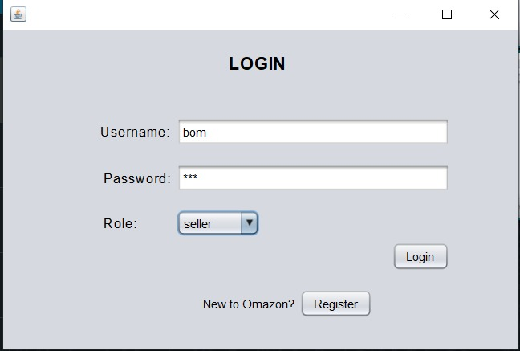
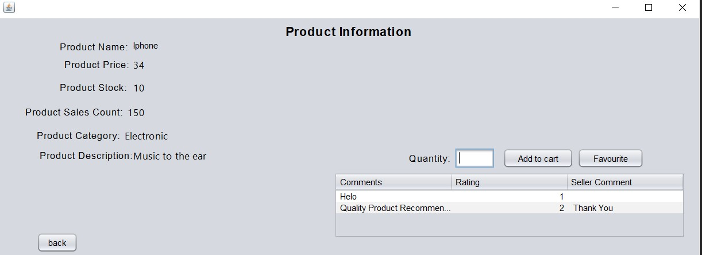
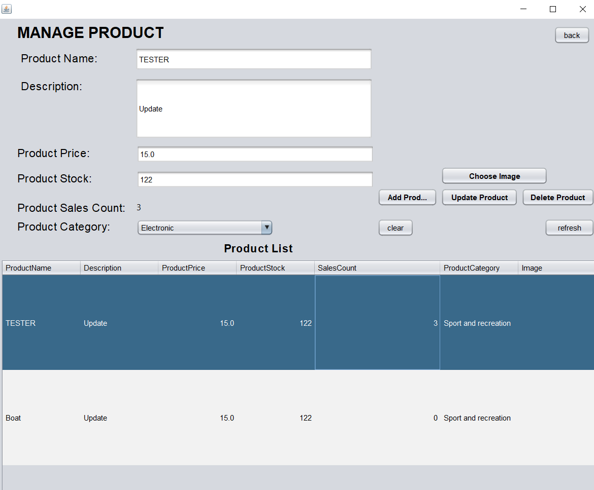
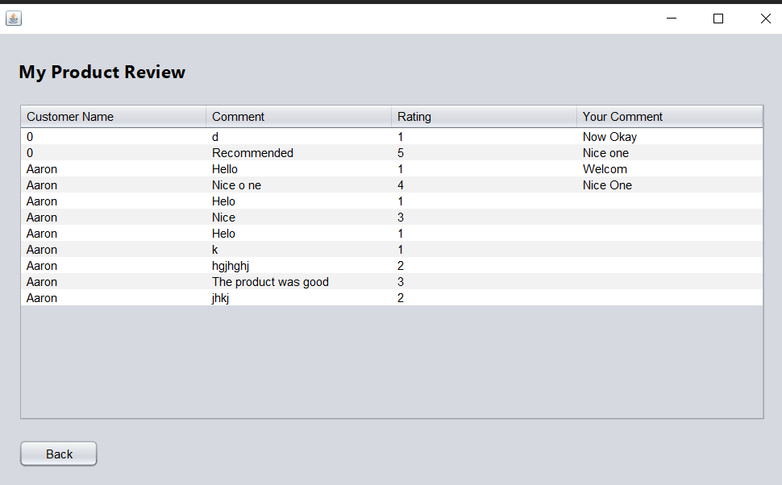

## Assignment Report


### University of Malaya 
### WIX1002 – Fundamental of Programming 
### Session 2021/2022

# Project 4:  Omazon

### Lecturer: Sir Nor Badrul Anuar

### Group Members

```
AARON CHEE THIAN SHIN	U2102810
ABRAR NAIM SHAHIRUDDIN BIN SHAHBUDIN	U2000666
JEE JIAN QI	U2102861
MUHAMMAD IQBAL BIN ZULSAFARI	U2001296

```
## Table of Content

``` 
      Aspects
Formation of Group
Introduction to Assignment
The Requirement of the Assignment
Extra Features
Approach to Solve the Assignment
Description of the Solution
Flowchart
Project Timeline
Problems Faced during Assignment

```

## Formation of Group 

```
Aaron Chee Thian Shin (Leader) : GUI Designing	Design GUI related to Customer-side.
                               :1. Doing the coding part for Customer Perspective and the code related to Customer-side.
                               :2. Search for the example of code If needed and modify the code according to our assignment.
                               :3. Connect MySQL to our assignment.
                               :4. Ensure the program is making the correct function and satisfying the requirement of the assignment.
                               :5. Check whether the overall program can be improved or not.
                               
        
Abrar Naim Shahiruddin Bin Shahbudin : GUI Designin design GUI related to Seller-side.
                                     : 1. Doing the coding part for Seller Perspective and the code related to Seller-side.
                                     : 2. Search for the example of code If needed and modify the code according to our assignment.
                                     : 3. Connect MySQL to the assignment.
                                     : 4. Ensure the code can be functioned in every condition.
                                     : 5. Fix the code when there is a bug encountered.

Jee Jian Qi                          : 1. Prepare Report write an assignment report and search for any information needed in the report writing.
                                     : 2. Draw Flowchart draw a flowchart to briefly describe the function of program to make other people easier to understand the program.
                                     : 3. Check the report. Correct the report if there is mistakes found in the report.
                                     : 4. Check whether the report still can be improved or not.
                                     : 5. Report Compiling	After checking the report, compile and finalize the report for submission.

Muhammad Iqbal Bin Zulsafari         : 1. Prepare Report write an assignment report and generate idea on how to write the report.
                                     : 2. Flowchart Checking Checking the flowchart after the flowchart is done and correct it when there is mistakes in the flowchart.
                                     : 3. Check whether the report still can be improved or not.
                                     : 4. Correct the report if there is mistake
                                     : 5. Report Compiling after checking the report, compile and finalize the report for submission. 
```

## Introduction to Assignment
```
Mother: Oma, help mum go to the supermarket to buy some daily necessities. Here is the product list for you. You can also buy some…. 

Oma: Wait wait wait, hold on, mum. Are you serious? Outside is very dangerous now due to Covid, We are not encouraged to go outside. Are you sure you want me to go to a supermarket which is full of people? 

Mother: Oh yeah, you’re true. But how about our daily necessities and food materials? We don’t have much stock at home. 

Oma: Yeah, I’m also wondering whether there is another way other than going out ourselves. 

Father: I think it would be great if there was an online shopping app, so that the people are able to buy the things they want online and would not contact any people. 

Oma & Mother: That’s a great idea! 

According to the scenario above, we understand that due to the pandemic, the people are not allowed or encouraged to go outside. However, our life still has to continue, how to do with the daily necessities and food materials? Luckily, Oma is a computer science student. He decided to make a contribution to society by building the app and named it as Omazon. However, he is not able to complete a whole app by himself. So, he wishes to have a group of capable, responsible and excellent teammates to help him to build the app.

```

## The Requirement of the Assignment 

```
1. Registration & Authentication
User can login with existing account or register a new account. The user can also logout from this page.

2. Product
This page will display the basic information of a product such as the product name, price, related image, product rating, reviews from customer, stock available, sales volume and description about the product. This page can be updated, removed or edited by a seller only.

3. Customer Perspective 
A customer can top up their account balance, save the product to Favourite List, add the product to cart, purchase the product with correct payment password, give the reviews after receiving the product, check order history and also manage his account. A user can manage his account by change the username, gmail, account password, change address, set or change payment password and also delete the account.

4. Seller Perspective
A seller can manage his product like uploading or removing his product. The user also be able to update the basic information of a product by change product name, price, amount or image. The seller will receive a notification if there is an order from customer. The seller can also comment to the review given by a customer and the seller can check the transaction list and profit earned.

5. Best Selling Product 
The main page will display 3 best-selling products based on the sales volume after the customer successfully login. The customer can directly go to the Product page of the product selected by the customer.

6. Search
The user can search for either product or seller only in the main page using the search bar. All the results which have similar keyword will be displayed in search page.

7. Categorise
This is used to specify the product category which can make the customer easier to search for needed product. The seller has to classify the product category when uploading a product.

```
## Extra Features

```
1. GUI: Graphical User Interface. We design GUI to make the function easier to be managed. We use GUI design to display all the information such as product detail, account detail, notification, review from customer and comment from seller. We also use GUI design to perform function like search, top up balance and login or logout. By implementing GUI, it can make Omazon is more user-friendly.


2. Database: A database is an organized collection of structured information, or data, typically stored electronically in a computer system. We use database to store the product information, review from customer, comment from seller to customer review and account information in this assignment. We can connect the database to NetBeans IDE to use the stored information.

```
## Approach to Solve the Assignment

```
1. We use NetBeans IDE, Java Swing and MySQL to complete this assignment. By using Java Swing, we have implemented GUI and functions in NetBeans IDE and MySQL is the database used to store all the information involved.

2. Search for the example of GUI design tutorial on the YouTube. This is because we haven’t learned about GUI in this semester. Hence, we need these examples to complete our assignment which involved GUI.

3. Search for the example code of some specific function in GUI and modify according to our project. For an example, code of connect to the database and code for button to have a needed function.

4. Ask our friends who have experience in using Java Swing and Database for suggestion when we cannot understand the particular part of coding. From the suggestion given, we can know what should we do for next step.

```
## Description to Solution

### 1. Login Page 
```
User can either log in with existing account by entering correct username and password or register for a new account in this page. The user can also choose whether login as a customer or a seller.
```
### 2. Register Form
```
User can register for a account by entering username, email and password if the user does not has any account yet.
```
### 3. Main Page for Customer
```
I. Categories
      All product will be displayed in a same page according to their category.
`	
      A. Electronics Page
   - All products which are in category “Electronics” will be displayed in this page.

      B. Sport and Recreation Page
    - All products which are in category “Sport and Recreation” will be displayed in this page.

      C. Food and Beverages Page
   - All products which are in category “Food and Beverages” will be displayed in this page.


      II. Best-Selling Page
     Three products with the highest sales volume will be displayed in this page.

      III. Shopping Cart Page
     Customer can store his wanted product or remove the unwanted product in this page before purchasing. Customer can also do the purchase after confirm the product which the customer wants to buy.

      IV. Setting Page
     Customer can make a change to his account in this page by selecting specific function.

          A. Change Username Page
        - Customer can change his username here.

	B. Change Email Page
       - Customer can change his email here.

	C. Change Password Page
       - Customer can change his account password here.

	D. Update Address Page
       - Customer can update his address here.

	E. Change Payment Password Page
       - Customer can change his payment password here. If customer has not set up the payment password, customer can set the payment password.

	F. Set Payment Password Page
       - Customer can set the payment password here if the customer has not set up the payment password.

              G. Current Balance Page
           - Customer can check his account balance here and perform top-up.

	H. Top-up Page
       - Customer can top-up a specific amount of balance by entering correct payment password in this page.
 
	I. Delete Account Page
       - Customer can permanently delete his account in this page. 

	J. Log Out Page
           - Customer can logout from Omazon in this page.

     V. Search Page
     Customer can search for product or seller name. All the product or seller with the similar keyword will be displayed in this page.

     VI. Favourite Page
     Customer can check his favourite product here.

     VII. Transaction History Page
     Customer can check the product purchased here.
           
          Review Page
            - After receiving the product, the customer can choose whether want to make a review on the product or not. The review will send to seller.

     
      VIII. Product Information Page
       After selecting a product, customer can see the basic information of the product selected. In this page, the customer can add the product into cart or add the product into the favourite list.

```
### 4. Main Page for Seller 
```
I. Profile Page
Seller can update his account in this page by choosing a specific function.

   A. Change Username Page
 - Seller can change the username in this page.

   B. Change Email Page
- Seller can change the email in this page.

    C. Change Password Page
- Seller can change the account password in this page.

    D. Update Address Page
- Seller can update the address in this page.

II. My Product Page
This page will display all the products the seller has. Seller can add a new product by inserting basic information and click the button “Add Product”. The seller can also update product by changing the product information. The seller can also delete the selected product. There is also a clear function that can clear all the information entered to a product and a refresh function that can refresh the product list to the latest one.

III. Transaction List Page
This page will display all the transaction done by customer to the seller. This page will also display the total profit earned by seller.

IV. Notification Page
A notification will be displayed in this page if there is an order placed by customer.

V. Product Review Page
A review to a product from customer will be displayed in this page and the seller can comment to the review from customer.

VI. Log Out Page
Seller can log out from the account using this button.
 
```
## FlowChart 


## Output
### Insert the screenshots here. 

## Project Timeline
```
Date	      Aspects
11/12/2021	              :1. Discuss on the assignment chosen and come out with the idea on how to do it.
                          :2 Search for tutorial related to GUI design and any code that needed for assignment.
18/12/2021                :Discuss on how to design GUI and generate the idea.
19/12/2021 – 9/1/2022	  :1. Design the GUI.
                          :2. Connect to the database and use the stored information.
                          :3. Combine all the GUI designed by different person.
                          :4. Check and improve the GUI.
                          :5. Code by referring to the tutorial video searched and modify  
                              the code according to the requirement of the assignment.
                          :6. Combine all the codes which already completed by         
                              different person and check the code and fix it when there is a bug.
10/1/2022 – 14/1/2022	  :1. Prepare the report.
                          :2. Create the flowchart of the assignment.
15/1/2022 – 16/1/2022	  :1. Make sure the project can be run in proper function.
                          :2. Screenshot the output.
                          :3. Check and improve the report.
18/1/2022	              :Submission of assignment.
27/1/2022	              :Presentation (Demo) of the assignment.

```
## Problems Faced During Assignment
```
1. It is difficult to have a face-to-face meeting because most of us don’t have same time which is free. Sometime we are forced to use online meeting.
2.Online meeting is not a efficient way to discuss the assignment. This is because we are difficult to pass on information to other members or the information passed on is difficult to understand by other members. 
3. We haven’t learned about GUI and database. This makes the assignment become more difficult to be completed since we need to find the tutorial on internet to learn the basic like how to make a GUI and how to connect the database.
4. Coding become very difficult because Java Swing is not easy to understand without any basic knowledge.

```
## Sample Output Program 

### Customer Prespectives 




<br/>
<br/>
<br/>
<br/>
<br/>
<br/>
<br/>


### Seller Prespectives
<br/>
<br/>
<br/>
<br/>
<br/>
<br/>
